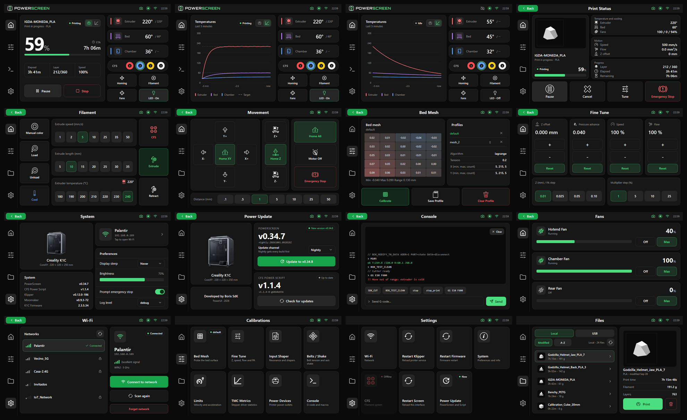

<!--
METADATOS DEL DOCUMENTO
Nombre: `README.md`
Fecha de creación: `2026-09-10`
Descripción: Presentación pública, alcance e instrucciones de PowerScreen para la Creality K1C.
Proyecto: `PowerScreen`
Última modificación: `2026-09-28`
-->

[English](#english) | [Español](#espanol)

---

<a name="english"></a>

# K1C CFS POWER SCREEN

This is a personal modification of PowerScreen focused exclusively on the Creality K1C. It keeps the touch interface base for Klipper/Moonraker and adds features specific to the CFS workflow and manual filament changes.

## Scope

This repository is intended only for:

- Creality K1C.
- The original K1C screen.
- MIPS builds compatible with K1C hardware.
- Custom CFS macros and scripts.

There are no builds, instructions, or support for Android, Raspberry Pi, `PowerScreenDroid`, or other printer models.

## Screenshots



## Installation / Update on a K1C

PowerScreen is installed from an SSH shell on the printer while logged in as `root`, either with the [CFS Power Script](https://github.com/borferkic/K1C-CFS-Power-Script) (recommended) or directly with the PowerScreen installer. Do not install while printing, heating, homing, or running a calibration.

> [!IMPORTANT]
> PowerScreen replaces the Creality touch screen. Installing it **disables** the Creality screen (`Monitor`, `display-server`) and the Creality services: Creality Cloud, Creality Print LAN connection and OTA firmware updates. Everything is backed up and restored if PowerScreen is removed. The installer shows this warning and asks for confirmation before changing anything.

### Requirements

- A Creality K1C with SSH access enabled and reachable on the local network.
- Internet access from the printer to GitHub.
- Moonraker running on the printer.
- The root password of the printer.

The only supported package is `powerscreen-zbolt.tar.gz`, the MIPS Z-Bolt package for the K1C.

### 1. Connect to the printer

Connect to the printer through SSH as `root`:

```sh
ssh -p 22 root@IP_DE_TU_K1C
```

All remaining commands in this section must be executed inside the printer shell.

Verify the platform and available space:

```sh
uname -m
df -h /usr/data
```

The K1C must report `mips`.

### 2. Install PowerScreen

#### Option A — with the CFS Power Script (recommended)

Install and open the [CFS Power Script](https://github.com/borferkic/K1C-CFS-Power-Script) as described in its README, then select:

```text
[Customize] Menu → 3) Install PowerScreen
```

The script shows the warning above, asks for confirmation and asks which build to install (`stable` or `nightly`). It then runs the PowerScreen installer without further questions.

#### Option B — with the PowerScreen installer

Download only the installer (there is no need to clone this repository) and run it:

```sh
wget --no-check-certificate -O /tmp/powerscreen-installer.sh https://raw.githubusercontent.com/borferkic/K1C-CFS-POWER-SCREEN/main/installer.sh
sh /tmp/powerscreen-installer.sh
```

The installer shows the warning, asks for confirmation and asks which build to install. The build can also be passed as an argument:

```sh
sh /tmp/powerscreen-installer.sh stable
sh /tmp/powerscreen-installer.sh nightly
```

#### What the installer does

- Downloads `powerscreen-zbolt.tar.gz` from this repository's GitHub Releases (the latest stable release, or the latest nightly pre-release) and extracts it under `/usr/data/powerscreen`.
- Backs up the original Creality files in `/usr/data/powerscreen-backup` and disables the Creality screen and services.
- Configures the service, the Klipper modules and the PowerScreen macros.
- Registers PowerScreen in Moonraker's Update Manager so it appears in Fluidd. The registered repository is `borferkic/K1C-CFS-POWER-SCREEN`.
- Saves the chosen build as the update channel, restarts Klipper and starts PowerScreen.

### 3. Update PowerScreen

Updates do not require running the installer again:

- On the printer screen: **System → Updates**. The update channel (`Nightly` or `Stable`) can be changed there.
- In Fluidd: **Settings → Software Updates**.

### 4. Remove PowerScreen

- With the CFS Power Script: `[Customize] Menu → 4) Remove PowerScreen`.
- Manually, to restore the Creality screen and services:

```sh
sh /usr/data/powerscreen/reinstall-creality.sh
```

## Inherited features

- Console and macro shell.
- Bed Mesh.
- Input Shaper.
- Print status.
- Spoolman integration.
- Extrusion and retraction.
- Temperature control.
- Fan, LED, and movement control.
- Fine tuning for speed, flow, Z-offset, and Pressure Advance.
- Velocity and acceleration limits.
- File browser.
- TMC metrics.

## Additional features in this modification

- `MANUAL M600` button in the extrusion panel.
- Manual filament change dialog adapted to the K1C screen.
- `SDK_UNLOAD_FILAMENT` and `SDK_LOAD_FILAMENT` actions.
- Green `RESUME` action.
- Red `STOP` action using `CANCEL_PRINT`.
- `CLOSE` action to close the dialog.
- Icons for load, unload, resume, and stop actions.
- Button layout reorganized for comfortable touchscreen use on the K1C.

## Pending work

Internal change logs, pending work and release history are kept in private project documentation outside the public repository.

## Support the project

If this project is useful to you, you can support its development through [PayPal](https://paypal.me/borissdk).

## Credits and thanks

This repository is maintained as K1C CFS POWER SCREEN and contains project-specific modifications for the Creality K1C.

The projects and resources used by the original foundation are also acknowledged:

- [GuppyScreen](https://github.com/ballaswag/guppyscreen) — native touchscreen UI for Klipper/Moonraker, created by [ballaswag](https://github.com/ballaswag).
- [LVGL](https://github.com/lvgl/lvgl)
- [Z-Bolt Icons](https://github.com/Z-Bolt/OctoScreen)
- [k1-discovery](https://github.com/ballaswag/k1-discovery) — MIPS toolchain and compatible `curl` helper used by the K1C workflow; thanks to `ballaswag`.
- [Moonraker](https://github.com/Arksine/moonraker)
- [KlipperScreen](https://github.com/KlipperScreen/KlipperScreen)
- [Fluidd](https://github.com/fluidd-core/fluidd)
- [Klippain Shake&Tune](https://github.com/Frix-x/klippain-shaketune)

## License

See [LICENSE](LICENSE) for the terms applicable to the original foundation and this modification.

---

<a name="espanol"></a>

# K1C CFS POWER SCREEN

Esta es una modificación personal de PowerScreen orientada exclusivamente a la Creality K1C. Mantiene la base de la interfaz táctil para Klipper/Moonraker y añade características específicas para el flujo CFS y el cambio manual de filamento.

## Alcance

Este repositorio está destinado únicamente a:

- Creality K1C.
- Pantalla original de la K1C.
- Compilación MIPS compatible con el hardware de la K1C.
- Macros y scripts personalizados para CFS.

No se incluyen builds, instrucciones ni soporte para Android, Raspberry Pi, `PowerScreenDroid` u otros modelos de impresora.

## Capturas de pantalla


## Instalación / actualización en una K1C

PowerScreen se instala desde una consola SSH de la impresora iniciada como `root`, con el [CFS Power Script](https://github.com/borferkic/K1C-CFS-Power-Script) (recomendado) o directamente con el instalador de PowerScreen. No instales mientras la impresora esté imprimiendo, calentando, haciendo homing o ejecutando una calibración.

> [!IMPORTANT]
> PowerScreen sustituye la pantalla táctil de Creality. Al instalarlo se **desactivan** la pantalla de Creality (`Monitor`, `display-server`) y los servicios de Creality: Creality Cloud, la conexión LAN de Creality Print y las actualizaciones de firmware OTA. Todo se respalda y se restaura si se quita PowerScreen. El instalador muestra este aviso y pide confirmación antes de cambiar nada.

### Requisitos

- Una Creality K1C con SSH habilitado y accesible desde la red local.
- Acceso a Internet desde la impresora hacia GitHub.
- Moonraker ejecutándose en la impresora.
- La contraseña root de la impresora.

El único paquete compatible es `powerscreen-zbolt.tar.gz`, el paquete MIPS Z-Bolt para la K1C.

### 1. Conectarse a la impresora

Conéctate a la impresora mediante SSH como `root`:

```sh
ssh -p 22 root@IP_DE_TU_K1C
```

Todos los comandos restantes de esta sección deben ejecutarse dentro de la consola de la impresora.

Verifica la plataforma y el espacio disponible:

```sh
uname -m
df -h /usr/data
```

La K1C debe responder `mips`.

### 2. Instalar PowerScreen

#### Opción A — con el CFS Power Script (recomendada)

Instala y abre el [CFS Power Script](https://github.com/borferkic/K1C-CFS-Power-Script) como se indica en su README y selecciona:

```text
[Customize] Menu → 3) Install PowerScreen
```

El script muestra el aviso anterior, pide confirmación y pregunta qué versión instalar (`stable` o `nightly`). Después ejecuta el instalador de PowerScreen sin más preguntas.

#### Opción B — con el instalador de PowerScreen

Descarga solo el instalador (no hace falta clonar este repositorio) y ejecútalo:

```sh
wget --no-check-certificate -O /tmp/powerscreen-installer.sh https://raw.githubusercontent.com/borferkic/K1C-CFS-POWER-SCREEN/main/installer.sh
sh /tmp/powerscreen-installer.sh
```

El instalador muestra el aviso, pide confirmación y pregunta qué versión instalar. La versión también se puede indicar como argumento:

```sh
sh /tmp/powerscreen-installer.sh stable
sh /tmp/powerscreen-installer.sh nightly
```

#### Qué hace el instalador

- Descarga `powerscreen-zbolt.tar.gz` desde las GitHub Releases de este repositorio (la última release estable o la última nightly) y lo extrae en `/usr/data/powerscreen`.
- Respalda los archivos originales de Creality en `/usr/data/powerscreen-backup` y desactiva la pantalla y los servicios de Creality.
- Configura el servicio, los módulos de Klipper y las macros de PowerScreen.
- Registra PowerScreen en el Update Manager de Moonraker para que aparezca en Fluidd. El repositorio registrado es `borferkic/K1C-CFS-POWER-SCREEN`.
- Guarda la versión elegida como canal de actualización, reinicia Klipper y arranca PowerScreen.

### 3. Actualizar PowerScreen

Las actualizaciones no requieren volver a ejecutar el instalador:

- En la pantalla de la impresora: **System → Updates**. Ahí también se puede cambiar el canal (`Nightly` o `Stable`).
- En Fluidd: **Settings → Software Updates**.

### 4. Quitar PowerScreen

- Con el CFS Power Script: `[Customize] Menu → 4) Remove PowerScreen`.
- Manualmente, para restaurar la pantalla y los servicios de Creality:

```sh
sh /usr/data/powerscreen/reinstall-creality.sh
```

## Características heredadas

- Consola y shell de macros.
- Bed Mesh.
- Input Shaper.
- Estado de impresión.
- Integración con Spoolman.
- Extrusión y retracción.
- Control de temperaturas.
- Control de ventiladores, LED y movimiento.
- Ajuste fino de velocidad, flujo, Z-offset y Pressure Advance.
- Límites de velocidad y aceleración.
- Explorador de archivos.
- Métricas TMC.

## Características adicionales de esta modificación

- Botón `MANUAL M600` en el panel de extrusión.
- Diálogo de cambio manual de filamento adaptado a la pantalla de la K1C.
- Acciones `SDK_UNLOAD_FILAMENT` y `SDK_LOAD_FILAMENT`.
- Acción `RESUME` en color verde.
- Acción `STOP` en color rojo mediante `CANCEL_PRINT`.
- Acción `CLOSE` para cerrar el diálogo.
- Iconos para las acciones de carga, descarga, reanudación y detención.
- Botones reorganizados para facilitar el uso táctil en la K1C.

## Pendientes

Los registros internos de cambios, pendientes e historial de versiones se conservan en documentación privada fuera del repositorio público.

## Apoyo al proyecto

Si este proyecto te resulta útil, puedes apoyar su desarrollo mediante [PayPal](https://paypal.me/borissdk).

## Créditos y agradecimientos

Este repositorio se mantiene como K1C CFS POWER SCREEN e incluye modificaciones específicas para la Creality K1C.

También se reconocen los proyectos y recursos utilizados por la base original:

- [GuppyScreen](https://github.com/ballaswag/guppyscreen) — interfaz táctil nativa para Klipper/Moonraker, creada por [ballaswag](https://github.com/ballaswag).
- [LVGL](https://github.com/lvgl/lvgl)
- [Z-Bolt Icons](https://github.com/Z-Bolt/OctoScreen)
- [k1-discovery](https://github.com/ballaswag/k1-discovery) — toolchain MIPS y helper `curl` compatible usados por el flujo de la K1C; agradecimiento a `ballaswag`.
- [Moonraker](https://github.com/Arksine/moonraker)
- [KlipperScreen](https://github.com/KlipperScreen/KlipperScreen)
- [Fluidd](https://github.com/fluidd-core/fluidd)
- [Klippain Shake&Tune](https://github.com/Frix-x/klippain-shaketune)

## Licencia

Consulta [LICENSE](LICENSE) para conocer los términos aplicables a la base original y a esta modificación.
